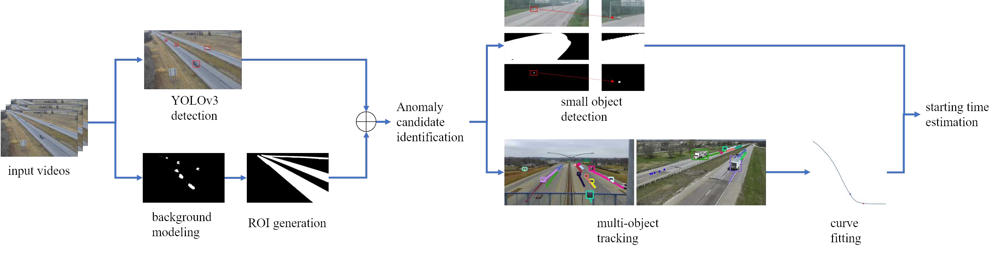

# 2019 CVPR AI City Challenge Track 3
This repository is used for traffic anomaly detection, including lane violation, traffic accident, emergency stop on highway, etc. Our method ranks 2nd in 2019 CVPR AI City Challenge Track 3.

## Updates
*For Collaborators: Please write your summary of your updates in the following format:*  
**5/31/2019&emsp;Update all the code for time decision.**  
4/9/2019&emsp;Update scripts for candidate selection and models

## Introduction
This is an overall description of the repository. Detailed descriptions could be found under each folder.  
Under **candidate selection** are the scripts for getting anomaly candidate video IDs.  
Scripts under **time decision** are used to get the exact starting time of the anomaly cases.  
**util** includes all necessary scripts for processing the output from detection to get tracking result using [TNT][1].  
All the models used should be placed under **model**, and you can find the download link for all four models in a txt file under that folder.  
You should run the scripts under **candidate selection** first, and then run TNT to get tracking result. After that, please run codes under **time decision** to get the exact starting time of the anomaly.

**Original Paper**: [Anomaly Candidate Identification and Starting Time Estimation of Vehicles from Traffic Videos](https://openaccess.thecvf.com/content_CVPRW_2019/papers/AI%20City/Wang_Anomaly_Candidate_Identification_and_Starting_Time_Estimation_of_Vehicles_from_CVPRW_2019_paper.pdf)

Xinyu (Xavier) Yuan  
4/9/2019

[1]: https://github.com/GaoangW/TNT/tree/master/AIC19
